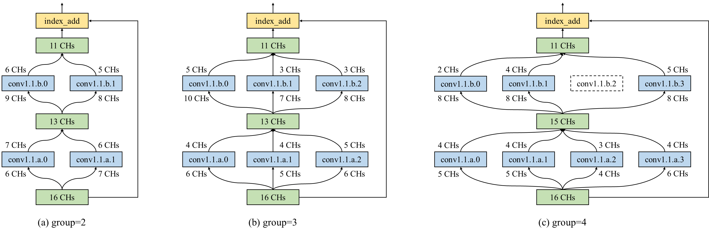
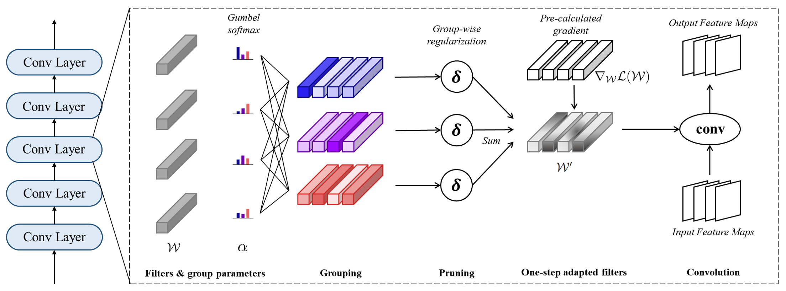

# Dynamic Structure Pruning

### **Dynamic Structure Pruning for Compressing CNNs \[AAAI 2023]**
Jun-Hyung Park, Yeachan Kim, Junho Kim, Joon-Young Choi, and SangKeun Lee

Generate **compact and efficient** CNNs based on **grouping and pruning** that **transform single-branch** convolutional layers into **multi-branch** convolutional layers



## Introduction

Dynamic Structure Pruning automatically learns intra-channel sparsity by optimizing filter groups and regularizing group channels.
This allows for higher efficiency from fine-grained pruing granularities, while producing generally accelerable (i.e., regular) structures.



## Requirements
- Python 3.7
- PyTorch 1.10.0
- TorchVision 0.11.0
- tqdm

## How to use DSP in your code

You should first train pre-trained models to learn groups and then prune and finetune the group-learned models.

Our group-learning and pruning modules require three steps.
1. Defining a wrapper
2. Initializing
3. Processing after every update (step)

Following sections show code examples using our modules.

**Differentiable Group Learning**

``` python
from dsp_module import *

...

# After defining your model, optimizer, criterion, etc.
group_trainer = GroupWrapper(model, optimizer, criterion, regularization_power, total_num_iterations, num_groups, temperature)

...

# Training iteration
for epoch in range(args.epochs):
    for x, y in train_dataloader:
        # Before forward (model(x))
        group_trainer.initialize()
        out = model(x)
        ...

        # After model update (optimizer.step())
        group_trainer.after_step(x, y)

...

```

**Group Channel Pruning**

``` python
from dsp_module import *

...

# Before loading group-learned checkpoints
pruner = PruneWrapper(model, num_groups, fp_every_nth_conv)

# fp_every_nth_conv means it prunes filters of every nth convolution layers.
# In our paper, we prune filters of the final layer in each residual block.
# In CIFAR-10, fp_every_nth_conv = 2, and in ImageNet, fp_every_nth_conv = 2 (ResNet18) or 3 (ResNet50)
# If your models have irregular numbers of layers in each residual block, 
# you can specify the indices of layers by setting fp_layer_indices=[1, 3, 5, 8, 11, 14, ...]
# If you set both fp_every_nth_conv and fp_layer_indices, the latter is prioritized.

...

# Before training starts
flops, params = pruner.initialize(pruning_rate)

# Training iteration
for epoch in range(args.epochs):
    for x, y in train_dataloader:
        
        ...

        # After model update (optimizer.step())
        pruner.after_step()
...
```

Please refer to our CIFAR-10 pruning codes (cifar_dsp.py and cifar_finetune.py) to help your understanding of our modules.

## Pruning on CIFAR-10 

**Pretraining**

``` bash
# pretrain ResNet20
python cifar_pretrain.py -l 20 [--save-dir ./cifarmodel] [--epochs 164] [--batch-size 128] [--lr 0.1] [--momentum 0.9] [--wd 1e-4]

# pretrain ResNet56
python cifar_pretrain.py -l 56 [--save-dir ./cifarmodel] [--epochs 164] [--batch-size 128] [--lr 0.1] [--momentum 0.9] [--wd 1e-4]
```

**Differentiable Group Learning**

``` bash
# ResNet20 with group 4, lambda=2e-3
python cifar_dsp.py -l 20 -g 4 -r 2e-3

# ResNet20 with group 2, lambda=2e-3
python cifar_dsp.py -l 20 -g 2 -r 2e-3

# ResNet56 with group 4, lambda=5e-4
python cifar_dsp.py -l 56 -g 4 -r 5e-4
```

**Group Channel Pruning**

``` bash
# ResNet20 with group 4, pruning rate=0.5
python cifar_finetune.py -l 20 -g 4 -p 0.5

# ResNet56 with group 4, pruning rate=0.5
python cifar_finetune.py -l 56 -g 4 -p 0.5

```

**Packing Pruned Models**

``` bash
python pack_model.py --ckpt [pruned_model_path] --save [save_path]
```

We upload checkpoints that show the median accuracy of five runs

| Model           |  ACC  | P.FLOPS | P.PARAMS  | CKPT     |
| --------------- | ----- | ------- | --------- | -------- |
| ResNet20 (g=4)  | 92.22 |  63.57  |   50.45   | [Link](https://github.com/irishev/DSP/raw/main/checkpoints/resnet20_g4.pt) |
| ResNet20 (g=3)  | 92.14 |  62.43  |   49.15   | [Link](https://github.com/irishev/DSP/raw/main/checkpoints/resnet20_g3.pt) |
| ResNet20 (g=2)  | 92.07 |  61.23  |   48.35   | [Link](https://github.com/irishev/DSP/raw/main/checkpoints/resnet20_g2.pt) |
| ResNet56 (g=4)  | 94.25 |  65.11  |   56.30   | [Link](https://github.com/irishev/DSP/raw/main/checkpoints/resnet56_g4.pt) |
| ResNet56 (g=3)  | 94.07 |  64.14  |   55.01   | [Link](https://github.com/irishev/DSP/raw/main/checkpoints/resnet56_g3.pt) |
| ResNet56 (g=2)  | 93.99 |  63.26  |   56.24   | [Link](https://github.com/irishev/DSP/raw/main/checkpoints/resnet56_g2.pt) |

How to use checkpoints
``` python
import torch
cnn = torch.jit.load('[CKPT_PATH]')
# You can use TensorRT or torch.jit.optimize_for_inference to achieve further acceleration.
```

_We slightly changed the implementation of regularization scaling to obtain better speedup._

_As a result, pruned results may be different from those in the paper (usually more pruned FLOPS and fewer pruned parameters)._

## Pruning on ImageNet 

**Pruned Models**

We will release pruned models for the ImageNet dataset soon!

## TODO
- [x] Implement model-agnostic pruner
- [ ] Release ImageNet models